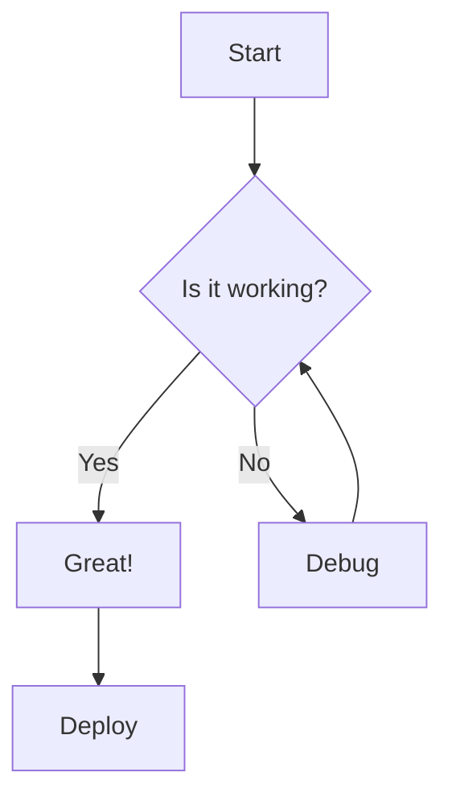

# Mermaid Diagram Preview

A Chrome extension for creating and previewing Mermaid diagrams with a split-pane editor. Works completely offline with no data sent to any server.

## Features

- **Split-pane interface** - Edit Mermaid markup on the left, see live preview on the right
- **Real-time rendering** - Diagram updates as you type
- **Resizable panes** - Drag the divider to adjust pane widths
- **Copy Code** - Copy your Mermaid markup to clipboard
- **Download SVG** - Export your diagram as an SVG file
- **Auto-save** - Your work persists in browser localStorage
- **Keyboard shortcuts** - Ctrl/Cmd+S to save, Ctrl/Cmd+Shift+C to copy
- **100% offline** - Mermaid.js is bundled locally, no internet required

## Installation

1. Open Chrome and navigate to `chrome://extensions/`
2. Enable **Developer mode** using the toggle in the top right corner
3. Click **Load unpacked**
4. Select the `mermaid-preview-extension` folder
5. The extension icon will appear in your toolbar

## Usage

1. Click the extension icon in Chrome's toolbar
2. Click **Open Mermaid Editor** to open the editor in a new tab
3. Enter your Mermaid diagram code in the left pane
4. See the rendered diagram in the right pane in real-time

## Supported Diagram Types

This extension supports all Mermaid diagram types including:

- Flowcharts
- Sequence diagrams
- Class diagrams
- State diagrams
- Entity Relationship diagrams
- Gantt charts
- Pie charts
- Git graphs
- And more

## Example

## Privacy

This extension processes all diagrams locally in your browser. No data is ever sent to external servers.
